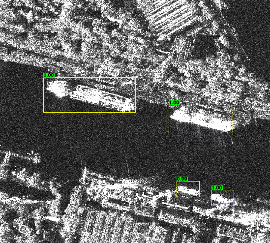
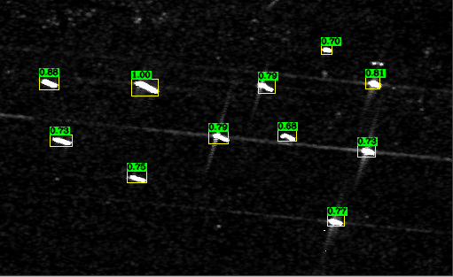
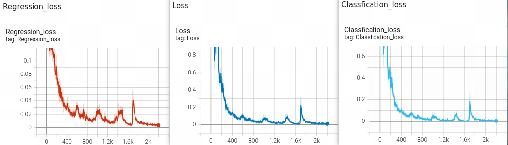
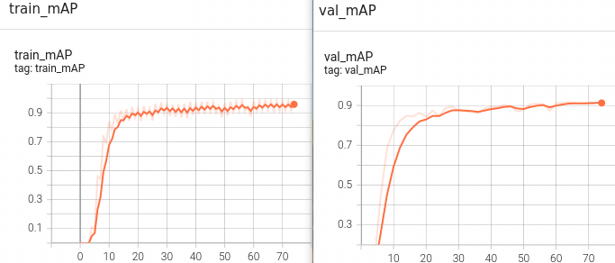
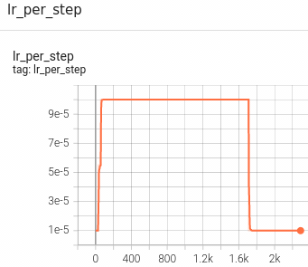

## :rocket:RetinaNet Horizontal Detector Based PyTorch
This is a horizontal detector **RetinaNet** implementation on remote sensing **ship dataset** (SSDD).  
This re-implemented retinanet has the almost the same mAP(iou=.5) with the MMdetection.  
RetinaNet Detector original paper link is [here](https://openaccess.thecvf.com/content_ICCV_2017/papers/Lin_Focal_Loss_for_ICCV_2017_paper.pdf).  
## :star2:Performance of the implemented RetinaNet Detector  

### Detection Performance on Offshore image.  
  

### Detection Performance on Inshore image.  
  

## :dart:Experiment
The SSDD dataset, well-trained retinanet detector, resnet-50 pretrained model on ImageNet, loss curve, evaluation metrics results are below, you could follow my experiment.  
- SSDD dataset [BaiduYun](https://pan.baidu.com/s/1KTA930p74xJf5uNU9z4ZNg) `extraction code=pa8j`  
- gt labels for eval [BaiduYun](https://pan.baidu.com/s/1sWx5T_YbAUkmTxvYzl9SfQ) `extraction code=vqaw`  
- well-trained retinanet detector weight file [BaiduYun]() `extraction code=`  
- pre-trained ImageNet resnet-50 weight file [BaiduYun](https://pan.baidu.com/s/16o2b03hBogEB2UDmhyPeAQ) `extraction code=mmql`  
- evaluation metrics(iou=.5)  

| Batch Size | Input Size | mAP (Mine) | mAP (MMdet) | Model Parameters |  
|:----------:|:----------:|:----------:|:-----------:|:----------------:|  
|32          | 416 x 416  | 0.89       | 0.8891      | 32.2 M           |  
- loss curve  
  

- mAP metrics on training set and val set  
  

- learning rate curve (using warmup lr rate)  
  

## :boom:Get Started  
### Installation
#### A. Install requirements:  
```
conda create -n retinanet python=3.7
conda activate retinanet
conda install pytorch==1.7.0 torchvision==0.8.0 torchaudio==0.7.0 cudatoolkit=11.0 -c pytorch
pip install -r requirements.txt  

Note: If you meet some troubles about installing environment, you can see the check.txt for more details.
```
#### B. Install nms module:
```
cd utils/HBB_NMS_GPU
make
```
## Demo
### A. Set project's data path  
you should set project's data path in `config.py` first.
```
# config.py
# Note: all the path should be absolute path.  
data_path = r'/$ROOT_PATH/SSDD_data/'  # absolute data root path  
output_path = r'/$ROOT_PATH/Output/'  # absolute model output path  
  
inshore_data_path = r'/$ROOT_PATH/SSDD_data_InShore/'  # absolute Inshore data path  
offshore_data_path = r'/$ROOT_PATH/SSDD_data_OffShore/'  # absolute Offshore data path  

# An example  
$ROOT_PATH
    -SSDD_data/
        -train/  # train set 
	    -*.jpg
	-val/  # val set
	    -*.jpg
	-annotations/  # gt label in json format (for coco evaluation method)  
	    -instances_train.json  
	    -instances_val.json  
	-ground-truth/  
	    -*.txt  # gt label in txt format (for voc evaluation method and evaluae inshore and offshore scence)  
    -SSDD_data_InShore/  
        -images/
	    -*.jpg  # inshore scence images
	-ground-truth/
	    -*.txt  # inshore scence gt labels  
    -SSDD_data_OffShore/  
        -images/  
	    -*.jpg  # offshore scence images
	-ground-truth/  
	    -*.txt  # offshore scence gt labels

    -Output/
        -checkpoints/
	    - the path of saving tensorboard log event
	-evaluate/  
	    - the path of saving model detection results for evaluate (coco/voc/inshore/offshore)  
```
### B. you should download the well-trained SSDD Dataset weight file.  
```
# download and put the well-trained pth file in checkpoints/ folder 
# and run the simple inferene script to get detection result  
# you can find the model output predict.jpg in show_result/ folder.  

python show.py --chkpt 54_1595.pth --result_path show_result --pic_name demo1.jpg  
```
## Train
### A. Prepare dataset
you should structure your dataset files as shown above.  
### B. Manual set project's hyper parameters
you should manual set projcet's hyper parameters in `config.py`  
```
1. data file structure (Must Be Set !)  
   has shown above.  

2. Other settings (Optional)  
   if you want to follow my experiment, dont't change anything.  
```
### C. Train RetinaNet detector on a custom dataset with pretrianed resnet-50 from scratch  
#### C.1 Download the pre-trained resnet-50 pth file  
you should download the pre-trained ImageNet Dataset resnet-50 pth file first and put this pth file in resnet_pretrained_pth/ folder.  
#### C.2 Train RetinaNet Detector on SSDD Dataset with pre-trained pth file  
```
# with batchsize 32 and using voc evaluation method during training for 50 epochs  
python train.py --batch_size 32 --epoch 50 --eval_method voc  
  
# with batchsize 32 and using coco evalutation method during training for 50 epochs  
python train.py --batch_size 32 --epoch 50 --eval_method coco  

Note: If you find classification loss change slowly, please be patient, it's not a mistake.
```
## Evaluation  
### A. evaluate model performance on val set.  
```
python eval.py --device 0 --evaluate True --FPS False --Offshore False --Inshore False --chkpt 54_1595.pth
```
### B. evaluate model performance on InShore and Offshore sences.  
```
python eval.py --device 0 --evaluate False --FPS False --Offshore True --Inshore True --chkpt 54_1595.pth
```
### C. evaluate model FPS
```
python eval.py --device 0 --evaluate False --FPS True --Offshore False --Inshore Fasle --chkpt 54_1595.pth
```
## :bulb:Inferences  
Thanks for these great work.  
[https://github.com/ming71/DAL](https://github.com/ming71/DAL)  
[https://github.com/zylo117/Yet-Another-EfficientDet-Pytorch](https://github.com/zylo117/Yet-Another-EfficientDet-Pytorch)
